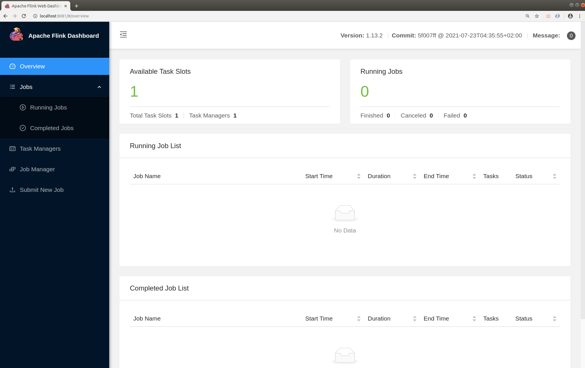
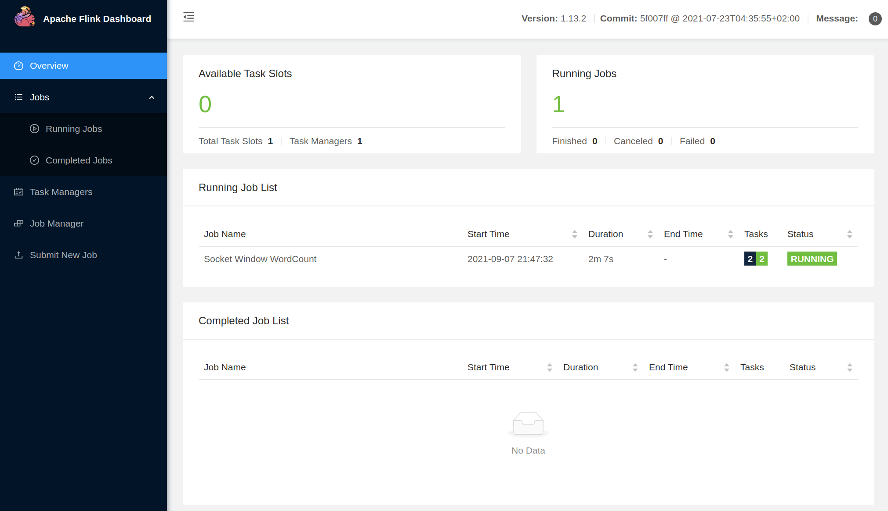
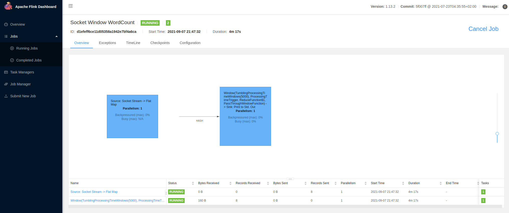

## 安装与运行 Flink

### 启动 Flink

```shell
(base) james@JamesUbuntu18:~/install/flink-1.13.2$ start-cluster.sh 
Starting cluster.
Starting standalonesession daemon on host JamesUbuntu18.
Starting taskexecutor daemon on host JamesUbuntu18.
(base) james@JamesUbuntu18:~/install/flink-1.13.2$ jps
4240 Main
9680 Jps
9541 TaskManagerRunner
9244 StandaloneSessionClusterEntrypoint
(base) james@JamesUbuntu18:~/install/flink-1.13.2$ 

```

### Flink UI 界面

[访问界面](http://localhost:8081/#/overview)




### WordCount 示例


```shell
(base) james@JamesUbuntu18:~/install/flink-1.13.2$ nc -l 9000
hello flink
hello james

bye james
bye flink

hi spark
bye spark

hello trino
bye trino
```

```shell
# 提交系统自带 WordCount 程序包
(base) james@JamesUbuntu18:~/install/flink-1.13.2$ bin/flink run examples/streaming/SocketWindowWordCount.jar --port 9000
Job has been submitted with JobID d1efeff6ce11d05358a1942e7bf4a6ca

```

```shell
(base) james@JamesUbuntu18:~/install/flink-1.13.2$ tail -f -n 100 log/flink-james-taskexecutor-0-JamesUbuntu18.out 
hello : 1
flink : 1
hello : 1
james : 1
 : 4
bye : 1
james : 1
bye : 1
flink : 1
 : 1
hi : 1
spark : 1
bye : 1
spark : 1
 : 2
trino : 1
hello : 1
bye : 1
trino : 1
```







### 自定义 WordCount 程序包

#### pom.xml

```xml
<project xmlns="http://maven.apache.org/POM/4.0.0" xmlns:xsi="http://www.w3.org/2001/XMLSchema-instance"
         xsi:schemaLocation="http://maven.apache.org/POM/4.0.0 http://maven.apache.org/maven-v4_0_0.xsd">
  <modelVersion>4.0.0</modelVersion>
  <groupId>com.james.flink</groupId>
  <artifactId>JamesFlinkProj</artifactId>
  <version>1.0-SNAPSHOT</version>
  <inceptionYear>2021</inceptionYear>
  <properties>
    <project.build.sourceEncoding>UTF-8</project.build.sourceEncoding>
    <flink.version>1.13.2</flink.version>
    <scala.version>2.11.12</scala.version>
    <scala.binary.version>2.11</scala.binary.version>
    <kafka.version>2.4.0</kafka.version>
  </properties>

  <repositories>
    <repository>
      <id>cloudera2</id>
      <url>https://repository.cloudera.com/artifactory/cloudera-repos/</url>
    </repository>
    <repository>
      <id>sonatype-oss</id>
      <url>http://oss.sonatype.org/content/repositories/snapshots</url>
      <snapshots>
        <enabled>true</enabled>
      </snapshots>
    </repository>
    <repository>
      <id>scala-tools.org</id>
      <name>Scala-Tools Maven2 Repository</name>
      <url>http://scala-tools.org/repo-releases</url>
    </repository>
  </repositories>

  <pluginRepositories>
    <pluginRepository>
      <id>scala-tools.org</id>
      <name>Scala-Tools Maven2 Repository</name>
      <url>http://scala-tools.org/repo-releases</url>
    </pluginRepository>
  </pluginRepositories>

  <dependencies>
<!--    <dependency>-->
<!--      <groupId>org.scala-lang</groupId>-->
<!--      <artifactId>scala-library</artifactId>-->
<!--      <version>${scala.version}</version>-->
<!--    </dependency>-->
<!--    <dependency>-->
<!--      <groupId>org.scala-lang</groupId>-->
<!--      <artifactId>scala-compiler</artifactId>-->
<!--      <version>${scala.version}</version>-->
<!--    </dependency>-->
    <dependency>
      <groupId>com.alibaba</groupId>
      <artifactId>fastjson</artifactId>
      <version>1.2.56</version>
    </dependency>
    <dependency>
      <groupId>org.apache.flink</groupId>
      <artifactId>flink-java</artifactId>
      <version>${flink.version}</version>
    </dependency>

    <dependency>
      <groupId>org.apache.flink</groupId>
      <artifactId>flink-table-api-java-bridge_2.11</artifactId>
      <version>${flink.version}</version>
    </dependency>
    <dependency>
      <groupId>org.apache.flink</groupId>
      <artifactId>flink-table-planner_2.11</artifactId>
      <version>${flink.version}</version>
    </dependency>
    <dependency>
      <groupId>org.apache.flink</groupId>
      <artifactId>flink-table-common</artifactId>
      <version>${flink.version}</version>
    </dependency>
    <dependency>
      <groupId>org.apache.flink</groupId>
      <artifactId>flink-clients_2.11</artifactId>
      <version>${flink.version}</version>
    </dependency>
    <dependency>
      <groupId>redis.clients</groupId>
      <artifactId>jedis</artifactId>
      <version>3.1.0</version>
    </dependency>
    <dependency>
      <groupId>mysql</groupId>
      <artifactId>mysql-connector-java</artifactId>
      <version>5.1.48</version>
    </dependency>

    <dependency>
      <groupId>junit</groupId>
      <artifactId>junit</artifactId>
      <version>4.12</version>
      <scope>test</scope>
    </dependency>
    <dependency>
      <groupId>org.apache.logging.log4j</groupId>
      <artifactId>log4j-core</artifactId>
      <version>2.13.0</version>
    </dependency>
    <dependency>
      <groupId>org.slf4j</groupId>
      <artifactId>slf4j-log4j12</artifactId>
      <version>1.7.30</version>
    </dependency>
  </dependencies>

  <build>
    <plugins>
<!--      <plugin>-->
<!--        <groupId>org.apache.maven.plugins</groupId>-->
<!--        <artifactId>maven-eclipse-plugin</artifactId>-->
<!--        <configuration>-->
<!--          <downloadSources>true</downloadSources>-->
<!--          <buildcommands>-->
<!--            <buildcommand>ch.epfl.lamp.sdt.core.scalabuilder</buildcommand>-->
<!--          </buildcommands>-->
<!--          <additionalProjectnatures>-->
<!--            <projectnature>ch.epfl.lamp.sdt.core.scalanature</projectnature>-->
<!--          </additionalProjectnatures>-->
<!--          <classpathContainers>-->
<!--            <classpathContainer>org.eclipse.jdt.launching.JRE_CONTAINER</classpathContainer>-->
<!--            <classpathContainer>ch.epfl.lamp.sdt.launching.SCALA_CONTAINER</classpathContainer>-->
<!--          </classpathContainers>-->
<!--        </configuration>-->
<!--      </plugin>-->

      <plugin>
        <artifactId>maven-compiler-plugin</artifactId>
        <version>2.3.2</version>
        <configuration>
          <source>1.8</source>
          <target>1.8</target>
          <encoding>UTF-8</encoding>
        </configuration>
      </plugin>

      <plugin>
        <artifactId>maven-assembly-plugin</artifactId>
        <configuration>
          <descriptorRefs>
            <descriptorRef>jar-with-dependencies</descriptorRef>
          </descriptorRefs>
        </configuration>
        <executions>
          <execution>
            <id>make-assembly</id>
            <phase>package</phase>
            <goals>
              <goal>single</goal>
            </goals>
          </execution>
        </executions>
      </plugin>
    </plugins>
  </build>
  <reporting>
    <plugins>
<!--      <plugin>-->
<!--        <groupId>org.scala-tools</groupId>-->
<!--        <artifactId>maven-scala-plugin</artifactId>-->
<!--        <configuration>-->
<!--          <scalaVersion>${scala.version}</scalaVersion>-->
<!--        </configuration>-->
<!--      </plugin>-->
    </plugins>
  </reporting>
</project>
```

#### WordCountDataStream.java

```java
package com.james.flink.app.wc;


import org.apache.flink.api.common.functions.FlatMapFunction;
import org.apache.flink.api.java.tuple.Tuple2;
import org.apache.flink.streaming.api.TimeCharacteristic;
import org.apache.flink.streaming.api.datastream.DataStream;
import org.apache.flink.streaming.api.environment.StreamExecutionEnvironment;
import org.apache.flink.streaming.api.windowing.time.Time;
import org.apache.flink.util.Collector;


/**
 * Created by James on 21-9-7 下午10:37
 */
public class WordCountDataStream {
    public static void main(String[] args) throws Exception {

        StreamExecutionEnvironment env = StreamExecutionEnvironment.getExecutionEnvironment();
        env.setStreamTimeCharacteristic(TimeCharacteristic.ProcessingTime);

        DataStream<Tuple2<String, Integer>> dataStream = env
                .socketTextStream("localhost", 9999)
                .flatMap(new Splitter())
                .keyBy(value -> value.f0)
                .timeWindow(Time.seconds(5))
                .sum(1);

        dataStream.print();

        env.execute("Window WordCount");
    }

    public static class Splitter implements FlatMapFunction<String, Tuple2<String, Integer>> {
        @Override
        public void flatMap(String sentence, Collector<Tuple2<String, Integer>> out) throws Exception {
            for (String word : sentence.split(" ")) {
                out.collect(new Tuple2<String, Integer>(word, 1));
            }
        }
    }
}


```

```shell
# 提交自定义 WordCount 程序包

bin/flink run -c com.james.flink.app.wc.WordCountDataStream  ext/JamesFlinkProj-1.0-SNAPSHOT.jar

```


## Flink 集成 Iceberg

