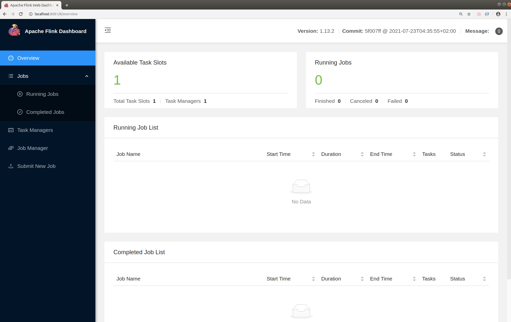
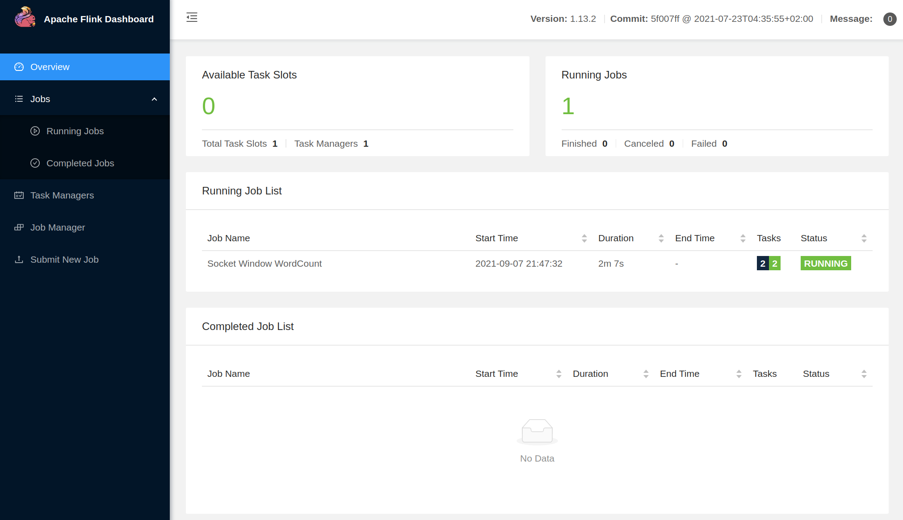
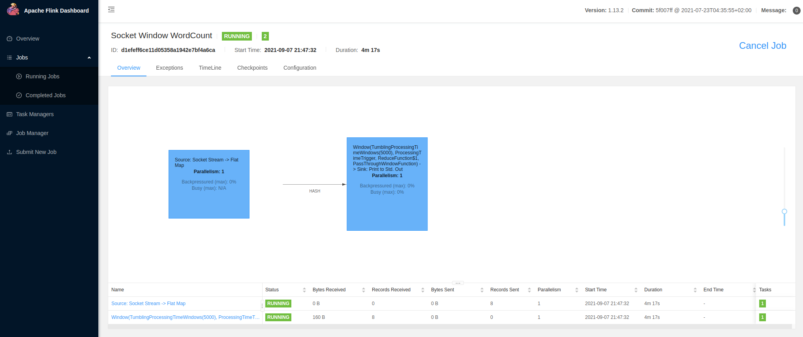
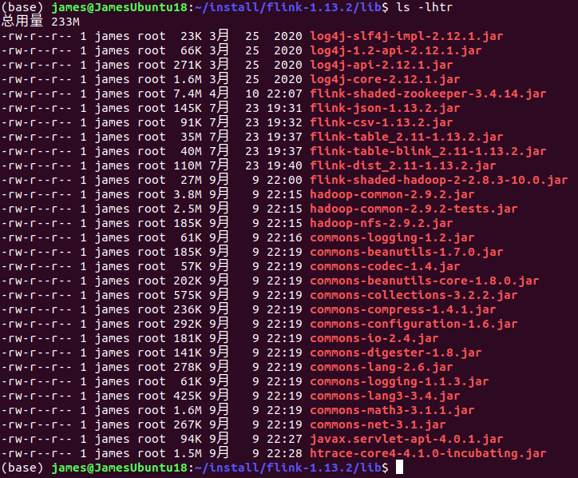
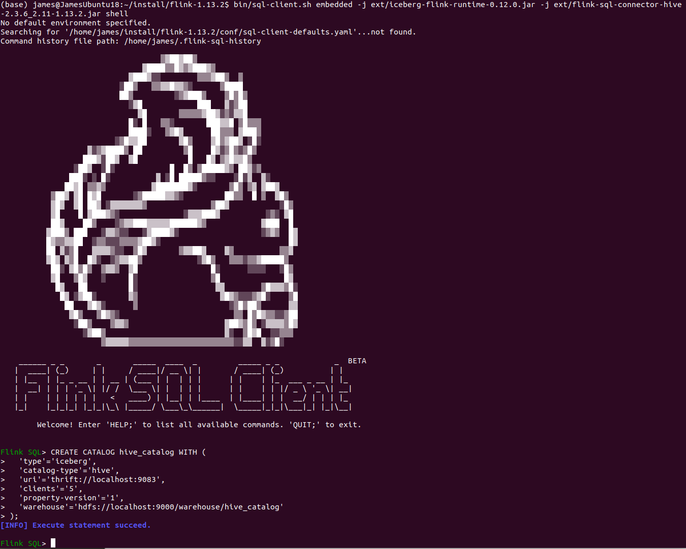

## 安装与运行 Flink

### 启动 Flink

```shell
(base) james@JamesUbuntu18:~/install/flink-1.13.2$ start-cluster.sh 
Starting cluster.
Starting standalonesession daemon on host JamesUbuntu18.
Starting taskexecutor daemon on host JamesUbuntu18.
(base) james@JamesUbuntu18:~/install/flink-1.13.2$ jps
4240 Main
9680 Jps
9541 TaskManagerRunner
9244 StandaloneSessionClusterEntrypoint
(base) james@JamesUbuntu18:~/install/flink-1.13.2$ 

```

### Flink UI 界面

[访问界面](http://localhost:8081/#/overview)




### WordCount 示例


```shell
(base) james@JamesUbuntu18:~/install/flink-1.13.2$ nc -l 9999
hello flink
hello james

bye james
bye flink

hi spark
bye spark

hello trino
bye trino
```

```shell
# 提交系统自带 WordCount 程序包
(base) james@JamesUbuntu18:~/install/flink-1.13.2$ bin/flink run examples/streaming/SocketWindowWordCount.jar --port 9000
Job has been submitted with JobID d1efeff6ce11d05358a1942e7bf4a6ca

```

```shell
(base) james@JamesUbuntu18:~/install/flink-1.13.2$ tail -f -n 100 log/flink-james-taskexecutor-0-JamesUbuntu18.out 
hello : 1
flink : 1
hello : 1
james : 1
 : 4
bye : 1
james : 1
bye : 1
flink : 1
 : 1
hi : 1
spark : 1
bye : 1
spark : 1
 : 2
trino : 1
hello : 1
bye : 1
trino : 1
```







### 自定义 WordCount 程序包

#### pom.xml

```xml
<project xmlns="http://maven.apache.org/POM/4.0.0" xmlns:xsi="http://www.w3.org/2001/XMLSchema-instance"
         xsi:schemaLocation="http://maven.apache.org/POM/4.0.0 http://maven.apache.org/maven-v4_0_0.xsd">
  <modelVersion>4.0.0</modelVersion>
  <groupId>com.james.flink</groupId>
  <artifactId>JamesFlinkProj</artifactId>
  <version>1.0-SNAPSHOT</version>
  <inceptionYear>2021</inceptionYear>
  <properties>
    <project.build.sourceEncoding>UTF-8</project.build.sourceEncoding>
    <flink.version>1.13.2</flink.version>
    <scala.version>2.11.12</scala.version>
    <scala.binary.version>2.11</scala.binary.version>
    <kafka.version>2.4.0</kafka.version>
  </properties>

  <repositories>
    <repository>
      <id>cloudera2</id>
      <url>https://repository.cloudera.com/artifactory/cloudera-repos/</url>
    </repository>
    <repository>
      <id>sonatype-oss</id>
      <url>http://oss.sonatype.org/content/repositories/snapshots</url>
      <snapshots>
        <enabled>true</enabled>
      </snapshots>
    </repository>
    <repository>
      <id>scala-tools.org</id>
      <name>Scala-Tools Maven2 Repository</name>
      <url>http://scala-tools.org/repo-releases</url>
    </repository>
  </repositories>

  <pluginRepositories>
    <pluginRepository>
      <id>scala-tools.org</id>
      <name>Scala-Tools Maven2 Repository</name>
      <url>http://scala-tools.org/repo-releases</url>
    </pluginRepository>
  </pluginRepositories>

  <dependencies>
<!--    <dependency>-->
<!--      <groupId>org.scala-lang</groupId>-->
<!--      <artifactId>scala-library</artifactId>-->
<!--      <version>${scala.version}</version>-->
<!--    </dependency>-->
<!--    <dependency>-->
<!--      <groupId>org.scala-lang</groupId>-->
<!--      <artifactId>scala-compiler</artifactId>-->
<!--      <version>${scala.version}</version>-->
<!--    </dependency>-->
    <dependency>
      <groupId>com.alibaba</groupId>
      <artifactId>fastjson</artifactId>
      <version>1.2.56</version>
    </dependency>
    <dependency>
      <groupId>org.apache.flink</groupId>
      <artifactId>flink-java</artifactId>
      <version>${flink.version}</version>
    </dependency>

    <dependency>
      <groupId>org.apache.flink</groupId>
      <artifactId>flink-table-api-java-bridge_2.11</artifactId>
      <version>${flink.version}</version>
    </dependency>
    <dependency>
      <groupId>org.apache.flink</groupId>
      <artifactId>flink-table-planner_2.11</artifactId>
      <version>${flink.version}</version>
    </dependency>
    <dependency>
      <groupId>org.apache.flink</groupId>
      <artifactId>flink-table-common</artifactId>
      <version>${flink.version}</version>
    </dependency>
    <dependency>
      <groupId>org.apache.flink</groupId>
      <artifactId>flink-clients_2.11</artifactId>
      <version>${flink.version}</version>
    </dependency>
    <dependency>
      <groupId>redis.clients</groupId>
      <artifactId>jedis</artifactId>
      <version>3.1.0</version>
    </dependency>
    <dependency>
      <groupId>mysql</groupId>
      <artifactId>mysql-connector-java</artifactId>
      <version>5.1.48</version>
    </dependency>

    <dependency>
      <groupId>junit</groupId>
      <artifactId>junit</artifactId>
      <version>4.12</version>
      <scope>test</scope>
    </dependency>
    <dependency>
      <groupId>org.apache.logging.log4j</groupId>
      <artifactId>log4j-core</artifactId>
      <version>2.13.0</version>
    </dependency>
    <dependency>
      <groupId>org.slf4j</groupId>
      <artifactId>slf4j-log4j12</artifactId>
      <version>1.7.30</version>
    </dependency>
  </dependencies>

  <build>
    <plugins>
<!--      <plugin>-->
<!--        <groupId>org.apache.maven.plugins</groupId>-->
<!--        <artifactId>maven-eclipse-plugin</artifactId>-->
<!--        <configuration>-->
<!--          <downloadSources>true</downloadSources>-->
<!--          <buildcommands>-->
<!--            <buildcommand>ch.epfl.lamp.sdt.core.scalabuilder</buildcommand>-->
<!--          </buildcommands>-->
<!--          <additionalProjectnatures>-->
<!--            <projectnature>ch.epfl.lamp.sdt.core.scalanature</projectnature>-->
<!--          </additionalProjectnatures>-->
<!--          <classpathContainers>-->
<!--            <classpathContainer>org.eclipse.jdt.launching.JRE_CONTAINER</classpathContainer>-->
<!--            <classpathContainer>ch.epfl.lamp.sdt.launching.SCALA_CONTAINER</classpathContainer>-->
<!--          </classpathContainers>-->
<!--        </configuration>-->
<!--      </plugin>-->

      <plugin>
        <artifactId>maven-compiler-plugin</artifactId>
        <version>2.3.2</version>
        <configuration>
          <source>1.8</source>
          <target>1.8</target>
          <encoding>UTF-8</encoding>
        </configuration>
      </plugin>

      <plugin>
        <artifactId>maven-assembly-plugin</artifactId>
        <configuration>
          <descriptorRefs>
            <descriptorRef>jar-with-dependencies</descriptorRef>
          </descriptorRefs>
        </configuration>
        <executions>
          <execution>
            <id>make-assembly</id>
            <phase>package</phase>
            <goals>
              <goal>single</goal>
            </goals>
          </execution>
        </executions>
      </plugin>
    </plugins>
  </build>
  <reporting>
    <plugins>
<!--      <plugin>-->
<!--        <groupId>org.scala-tools</groupId>-->
<!--        <artifactId>maven-scala-plugin</artifactId>-->
<!--        <configuration>-->
<!--          <scalaVersion>${scala.version}</scalaVersion>-->
<!--        </configuration>-->
<!--      </plugin>-->
    </plugins>
  </reporting>
</project>
```

#### WordCountDataStream.java

```java
package com.james.flink.app.wc;


import org.apache.flink.api.common.functions.FlatMapFunction;
import org.apache.flink.api.java.tuple.Tuple2;
import org.apache.flink.streaming.api.TimeCharacteristic;
import org.apache.flink.streaming.api.datastream.DataStream;
import org.apache.flink.streaming.api.environment.StreamExecutionEnvironment;
import org.apache.flink.streaming.api.windowing.time.Time;
import org.apache.flink.util.Collector;


/**
 * Created by James on 21-9-7 下午10:37
 */
public class WordCountDataStream {
    public static void main(String[] args) throws Exception {

        StreamExecutionEnvironment env = StreamExecutionEnvironment.getExecutionEnvironment();
        env.setStreamTimeCharacteristic(TimeCharacteristic.ProcessingTime);

        DataStream<Tuple2<String, Integer>> dataStream = env
                .socketTextStream("localhost", 9999)
                .flatMap(new Splitter())
                .keyBy(value -> value.f0)
                .timeWindow(Time.seconds(5))
                .sum(1);

        dataStream.print();

        env.execute("Window WordCount");
    }

    public static class Splitter implements FlatMapFunction<String, Tuple2<String, Integer>> {
        @Override
        public void flatMap(String sentence, Collector<Tuple2<String, Integer>> out) throws Exception {
            for (String word : sentence.split(" ")) {
                out.collect(new Tuple2<String, Integer>(word, 1));
            }
        }
    }
}


```

```shell
# 提交自定义 WordCount 程序包

bin/flink run -c com.james.flink.app.wc.WordCountDataStream  ext/JamesFlinkProj-1.0-SNAPSHOT.jar

```


## 启动 Hive
```shell 
sudo /opt/lampp/xampp startmysql

start-dfs.sh

bin/hive --service metastore 2>&1 >> ./std.out &

hive


```


## Flink 集成 Iceberg
### 下载 jar 包放到 $FLINK_HOME/ext/ 目录下
```shell 
https://repo1.maven.org/maven2/org/apache/iceberg/iceberg-flink-runtime/0.12.0/iceberg-flink-runtime-0.12.0.jar

https://repo.maven.apache.org/maven2/org/apache/flink/flink-sql-connector-hive-2.3.6_2.11/1.13.2/flink-sql-connector-hive-2.3.6_2.11-1.13.2.jar
```


启动 Flink 的 sql-client，需要将如下图的 jar 文件拷贝到 $FLINK_HOME/lib 目录下：






### 创建 Hive Catalog

```shell
CREATE CATALOG hive_catalog WITH (
  'type'='iceberg',
  'catalog-type'='hive',
  'uri'='thrift://localhost:9083',
  'clients'='5',
  'property-version'='1',
  'warehouse'='hdfs://localhost:9000/user/hive/warehouse/iceberg/hive_catalog'
);

```

    - type: 只能使用iceberg,用于 iceberg 表格式。(必须)
    - catalog-type: Iceberg 当前支持hive或hadoopcatalog 类型。(必须)
    - uri: Hive metastore 的 thrift URI。 (必须)
    - clients: Hive metastore 客户端池大小，默认值为 2。 (可选)
    - property-version: 版本号来描述属性版本。此属性可用于在属性格式发生更改时进行向后兼容。当前的属性版本是 1。(可选)
    - warehouse: Hive 仓库位置, 如果既不将 hive-conf-dir 设置为指定包含 hive-site.xml 配置文件的位置，也不将正确的 hive-site.xml 添加到类路径，则用户应指定此路径。
    - hive-conf-dir: 包含 Hive-site.xml 配置文件的目录的路径，该配置文件将用于提供自定义的 Hive 配置值。 如果在创建 iceberg catalog 时同时设置 hive-conf-dir 和 warehouse，那么将使用 warehouse 值覆盖 < hive-conf-dir >/hive-site.xml (或者 classpath 中的 hive 配置文件)中的 hive.metastore.warehouse.dir 的值。
    
    
### 创建 Hadoop Catalog

```shell
CREATE CATALOG hadoop_catalog WITH (
  'type'='iceberg',
  'catalog-type'='hadoop',
  'property-version'='1',
  'warehouse'='hdfs://localhost:9000/warehouse/hadoop_catalog'
);

```    


```shell 
vi conf/sql-client-defaults.yaml

catalogs:
  - name: hive_catalog
    type: iceberg
    catalog-type: hive
    warehouse: hdfs://localhost:9000/warehouse/hive_catalog

```


### 创建 Hive 数据表
```shell
Flink SQL> use catalog hive_catalog;

Flink SQL> create database iceberg_db;

Flink SQL> use iceberg_db;

CREATE TABLE sample (id BIGINT COMMENT 'unique id', f_date STRING);

INSERT INTO sample VALUES (1, 'a');

insert into sample (id,f_date) values (1, 'a');


```

```shell 
(base) james@JamesUbuntu18:~/temp$ hadoop fs -ls /warehouse/hive_catalog/iceberg_db.db/
Found 1 items
drwxr-xr-x   - james supergroup          0 2021-09-09 22:54 /warehouse/hive_catalog/iceberg_db.db/sample
(base) james@JamesUbuntu18:~/temp$ 


```


### 使用数据


## Spark 集成 Iceberg
```shell
spark-shell --packages org.apache.iceberg:iceberg-spark3-runtime:0.12.0

```

```shell
bin/spark-sql --packages org.apache.iceberg:iceberg-spark3-runtime:0.12.0\
    --conf spark.sql.extensions=org.apache.iceberg.spark.extensions.IcebergSparkSessionExtensions \
    --conf spark.sql.catalog.spark_catalog=org.apache.iceberg.spark.SparkSessionCatalog \
    --conf spark.sql.catalog.spark_catalog.type=hive \
    --conf spark.sql.catalog.local=org.apache.iceberg.spark.SparkCatalog \
    --conf spark.sql.catalog.local.type=hadoop \
    --conf spark.sql.catalog.local.warehouse=$PWD/warehouse

```

```shell
CREATE TABLE local.db.table (id bigint, data string) USING iceberg


INSERT INTO local.db.table VALUES (1, 'a'), (2, 'b'), (3, 'c');

select * from local.db.table;


DELETE FROM local.db.table
WHERE data='b';

select * from local.db.table;
```


```shell
spark-sql> select * from local.db.table;
1	a
2	b
3	c
Time taken: 0.477 seconds, Fetched 3 row(s)

spark-sql> DELETE FROM local.db.table
         > WHERE data='b';
Time taken: 0.819 seconds

spark-sql> select * from local.db.table;
1	a
3	c
Time taken: 0.105 seconds, Fetched 2 row(s)


```


```shell
spark-sql> create table local.db.t_tgt select * from local.db.table;
Time taken: 0.138 seconds

spark-sql> select * from local.db.t_tgt;
1	a
3	c
Time taken: 0.074 seconds, Fetched 2 row(s)

spark-sql> MERGE INTO local.db.t_tgt t
         > USING (select * from local.db.table) s
         > ON t.id = s.id
         > WHEN MATCHED AND s.data = 'c' THEN UPDATE SET t.data = 'm';
Time taken: 0.787 seconds
spark-sql> select * from local.db.t_tgt;
1	a
3	m
Time taken: 0.052 seconds, Fetched 2 row(s)


```


## 参考资料
[Flink集成Iceberg简介](https://www.cnblogs.com/swordfall/p/14548574.html)

[Flink结合Iceberg的一种实现方式笔记](https://zhengqiang.blog.csdn.net/article/details/112507474)

[Spark Writes](http://iceberg.apache.org/spark-writes/#insert-into)

[Spark Configuration](http://iceberg.apache.org/spark-configuration/#spark-configuration)